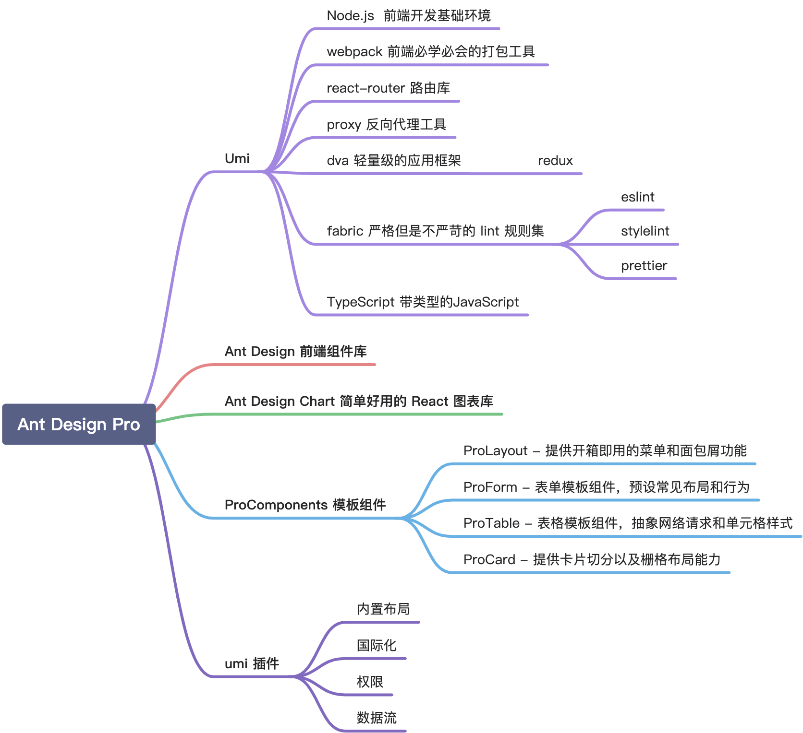
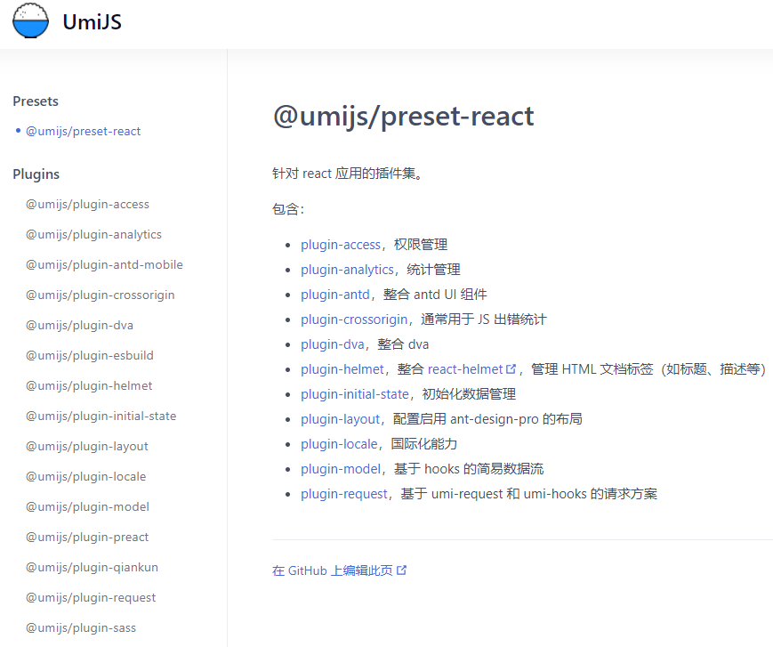
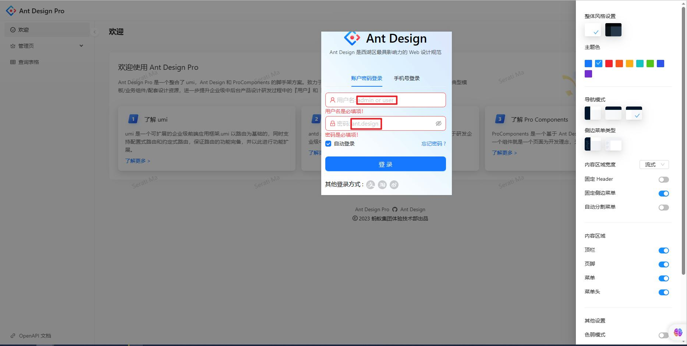
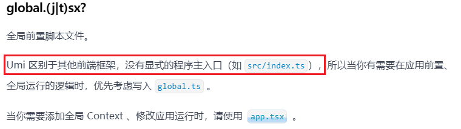
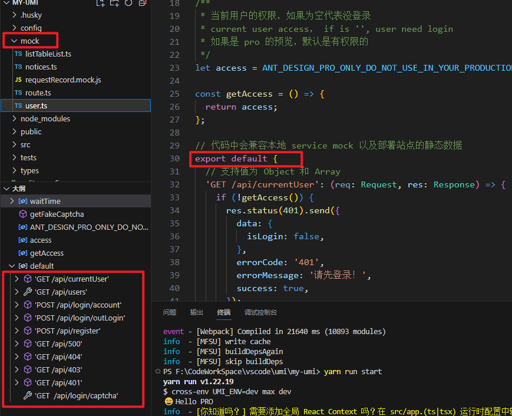
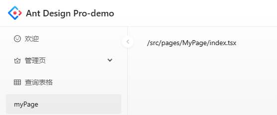
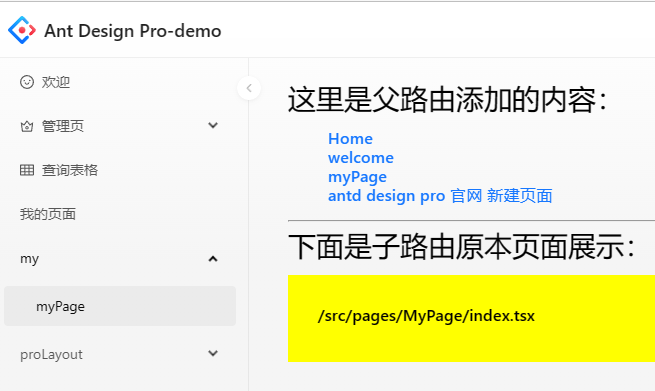

> 不错的笔记
>
> https://zhuanlan.zhihu.com/p/648178323
>
> https://www.zhihu.com/column/c_1659615892035194880

# antd design pro v5[完整版] 5w字全网最全入门踩坑指南

## 1. 前言

在学习了一段时间前端知识，研究了一段时间的React之后，初步对React有了了解和掌握，能够看懂一些代码和运行逻辑。

在解决了Rdeux和Router之后，决定尝试上手实例，从理论向实践转移。

在学习的过程中，见的最多的是create-react-app脚手架创建项目，当然这个是很基础的一个创建，很多东西需要自己装配上去。而antd desing pro封装了80%的东西。可以减轻我们前期的一个学习曲线。

[官网](https://pro.ant.design/zh-CN/)：直接开始使用，右上角切换成中文。

可以先了解一下文档中的【新手须知】，了解一下antd pro都有哪些功能特性：



### 1.1 umi

其中依赖了UMI框架，这是一个集成式的企业级前端框架。以React-Router6路由为基础+丰富的插件集，支撑应用的所有需要的方面，并且支持扩展。

目前已有4个版本，pro官方文档中及其他地方链接的地址很多事v3的，然后v4又变化了，所以导致很多地方都不能够使用成功，要注意一下。官网地址：

v4: UmiJS - 插件化的企业级前端应用框架
v3: UmiJS - 插件化的企业级前端应用框架
v2: UmiJS

和@umijs/max是啥关系？

umi max解释为最大最全的umi集合。umi已经形成了很多插件用来解决前端开发中遇到的各种问题，但是这些插件分布在各处（这就是为啥每个插件都有自己的git地址）。为了方便开发者更方便的使用这些插件，就打造了@umijs/max，集成所有的umi插件。

```shell
$ npx create-umi@latest
? Pick Umi App Template › - Use arrow-keys. Return to submit.
    Simple App
❯   Ant Design Pro
    Vue Simple App
$ npx max g test
```

新建的项目默认安装以下插件, 可以按需开启：

- 权限
- 站点统计
- Antd
- 图表
- dva
- initial-state
- 数据流
- 布局和菜单
- 国际化(多语言)
- model
- 乾坤微前端
- 请求库
- Tailwind CSS
- CSS-IN-JS
- 请求方案
- 全局数据存储方案
- Module Federation



**import all from umi**

很多人可能都第一次听到。import all from umi 意思是所有 import 都来自umi。

比如 dva 不是import { connect } from 'dva'，而是import { connect } from 'umi'，从 umi 中导出。导出的方法不仅来自 umi 自身，还来自 umi 插件。

> 章节引用：
>
> [1]. 《SEE Conf: Umi 4 设计思路文字稿》。

## 2.安装

### 2.1准备

首先让自己的环境配置完成，npm，yarn装一下，registry、global、cache配置改一下，node.js 版本升级到10以上。

### 2.2 脚手架pro-cli安装

官网使用了`npm i @ant-design/pro-cli -g`安装脚手架，我使用了`yarn add -g @ant-design/pro-cli`全局安装。安装完成可以直接在全局文件夹中看到pro和pro.cmd。

> 全局安装的文件夹：npm config get prefix 或 yarn config get global-folder

### 2.3 创建项目

直接使用pro create myapp在当前目录创建项目

```shell
pro create myapp
```

### 2.4 选择 umi 的版本

我尝试了umi@3，但是最终运行不起来，资料太少，没搜到解决问题。

最终选择了umi@4，成功运行。

```shell
? 使用 umi@4 还是 umi@3 ? (Use arrow keys)
❯ umi@4
umi@3
```

### 2.5 安装依赖

```shell
cd myapp
yarn
```

### 2.6 运行并访问

```powershell
PS F:\CodeWorkSpace\vscode\umi\my-umi> yarn run start
yarn run v1.22.19
$ cross-env UMI_ENV=dev max dev
  Hello PRO
info  - [你知道吗？] 需要添加全局 React Context 吗？在 src/app.(ts|tsx) 运行时配置中轻松解决，详见 https://umijs.org/docs/api/runtime-config
Using openapi Plugin
info  - Umi v4.0.74
info  - Preparing...
warn  - GET /api/rule is duplicated in F:\CodeWorkSpace\vscode\umi\my-umi\mock\requestRecord.mock.js and F:\CodeWorkSpace\vscode\umi\my-umi\mock\listTableList.ts
warn  - GET /api/currentUser is duplicated in F:\CodeWorkSpace\vscode\umi\my-umi\mock\user.ts and F:\CodeWorkSpace\vscode\umi\my-umi\mock\requestRecord.mock.js
warn  - POST /api/login/account is duplicated in F:\CodeWorkSpace\vscode\umi\my-umi\mock\user.ts and F:\CodeWorkSpace\vscode\umi\my-umi\mock\requestRecord.mock.js
warn  - POST /api/login/outLogin is duplicated in F:\CodeWorkSpace\vscode\umi\my-umi\mock\user.ts and F:\CodeWorkSpace\vscode\umi\my-umi\mock\requestRecord.mock.js
info  - [MFSU] restore cache
        ╔════════════════════════════════════════════════════╗
        ║ App listening at:                                  ║
        ║  >   Local: http://localhost:8000                  ║
ready - ║  > Network: http://192.168.18.112:8000             ║
        ║                                                    ║
        ║ Now you can open browser with the above addresses↑ ║
        ╚════════════════════════════════════════════════════╝
Browserslist: caniuse-lite is outdated. Please run:
  npx update-browserslist-db@latest
  Why you should do it regularly: https://github.com/browserslist/update-db#readme
event - [Webpack] Compiled in 3690 ms (492 modules)
info  - [MFSU] skip buildDeps
wait  - [Webpack] Compiling...
event - [Webpack] Compiled in 169 ms (478 modules)
info  - [MFSU] skip buildDeps
wait  - [Webpack] Compiling...
event - [Webpack] Compiled in 112 ms (478 modules)
info  - [MFSU] skip buildDeps
```



这就成功了，访问时需要登录，用户名密码可以看到，登录后进入了主页，可以熟悉一下，点击看看这个例子。另外右侧有个设置的图标，点开后可以对整个项目的布局和一些东西进行调整，然后下面有个“拷贝设置”。将复制结果可以粘贴到项目中config\defaultSettings.ts中，替换同名变量。保存后就可以永久更改为调整后的样式。

## 3.文件目录说明

这个可以看一下官网给出的，可能和自己当前项目的不一样。参考了解一下就行。每个文件夹后面都会遇到并明白其设计意图和作用。

antd pro是一个组装好的脚手架，这个意味着很多的东西都是约定大于配置的，所以必须要按照约定进行开发，否则就需要深入了解其作用和意图，明确动哪里的配置可以满足自定义或让自己的生效。

```powershell
├── config                   # umi 配置，包含路由，构建等配置（常用！）
├── mock                     # 本地模拟数据
├── public
│   └── favicon.png          # Favicon
├── src
│   ├── assets               # 本地静态资源
│   ├── components           # 业务通用组件
│   ├── e2e                  # 集成测试用例
│   ├── layouts              # 通用布局
│   ├── models               # 全局 dva model（常用！）
│   ├── pages                # 业务页面入口和常用模板（常用！）
│   ├── services             # 后台接口服务
│   ├── utils                # 工具库
│   ├── locales              # 国际化资源
│   ├── global.less          # 全局样式
│   └── global.ts            # 全局 JS
├── tests                    # 测试工具
├── README.md
└── package.json
```

> umi4 的目录说明：https://umijs.org/docs/guides/directory-structure#目录结构



## 4. 简易数据流&Mock

### 4.1 简易数据 Model

大多数页面的数据流转都是在当前页完成，在页面挂载的时候请求后端接口获取并消费。

这种场景下并不需要复杂的数据流方案。但是也存在需要全局共享的数据，如用户的角色权限信息或者其他一些页面间共享的数据。

为了实现在多个页面中的数据共享，以及一些业务可能需要的简易的数据流管理的场景，基于 hooks & umi 插件@umijs/plugin-model实现了一种轻量级的全局数据共享的方案。

#### 1.创建

在src/models目录下新建文件，文件名会成为 model 的 namespace. 允许使用 ts, js, tsx（推荐）, jsx（不推荐）四种后缀。

> 一个 model 的内容需要是一个标准的 JavaScript function，并被默认导出，可以在 function 中使用 hooks.

```javascript
// counter.ts
import { useState, useCallback } from 'react';

export default () => {
  const [counter, setCounter] = useState(0);
  const increment = useCallback(() => setCounter((c) => c + 1), []);
  const decrement = useCallback(() => setCounter((c) => c - 1), []);
  return { counter, increment, decrement };
};
```

#### 2. 使用

从umi中导出useModel。useModel是一个React Custom Hook，传入namespace即可获取对应model的返回值。

```javascript
import { useModel } from 'umi';

export default () => {
  const {counter}= useModel('counter');
  return <div>{counter}</div>;
};
```

- 带函数的使用

useModel可以接受一个可选的第二个参数，可以用于性能优化。

当组件只需要消费model中的部分参数，而对其他参数的变化并不关心时，可以传入一个函数用于过滤。

函数的返回值将取代model的返回值，成为useModel的最终返回值。例如：

```javascript
import { useModel } from 'umi';

export default () => {
  const { add, minus } = useModel('counter', (ret) => ({
    couter: ret.couter % 5
    add: ret.increment,
    minus: ret.decrement,
  }));

  return (
    <div>
      {couter}
      <button onClick={add}>add by 1</button>
      <button onClick={minus}>minus by 1</button>
    </div>
  );
};
```

> umi 启动时，plugin-model 会监听文件变化，动态生成可消费的 hooks 及对应 ts 类型，因此天然具有较好的代码补全能力。
>
> vscode 插件：https://marketplace.visualstudio.com

### 4.2 Mock

这个应该不陌生吧，可能没用过，但是一定听过吧，其实就是给前端做一些请求的假数据。

没听过的可以简单查阅一下资料。也不必细究它的语法，知道哪里能查到，能满足生成哪些需要的假数据就可以了。

在Pro 中约定了两种 mock 的定义方式。

- 在根目录的mock中接入（目前的项目中使用的这个）
- 在src/page中的mock.ts的文件中配置

一个标准的mock由三部分组成，以List配置为例。

```javascript
export default {
  'GET /api/rule': [{ name: '12' }],
  'POST /api/rule': (req: Request, res: Response, u: string) => {
    res.send({
      success: true,
    });
  },
};
```

第一部分是网络请求的Method配置，完整的列表可以看这里。一般我们都会使用GET和POST。

第二部分是URL也就是我们发起网络请求的地址/api/rule。一般我们会使用统一的前缀方便代理的使用。

第三部分是数据处理，我们可以配置一个JSON，JSON数据会直接返回。或者是配置一个function，function有三个参数req、res、url。具体使用方式与express相同。数据必须要通过res.send来返回。



## 5. 个性化调整

### 5.1 更改标题

config\defaultSettings.ts修改

- // 设置标题的 title和左上角文字 title: 'Ant Design Pro-demo',
- // 修改左上角的 logo logo: ''

### 5.2 添加加载页（未操作）

### 5.3 添加页面

- 在src/pages下创建文件夹，存放新页面，文件夹下创建文件index.tsx，是这个文件名了在使用这个页面的时候就可以直接使用文件夹名，应用会默认去找这个文件夹下的index，如果文件名改成了其他，那在其他地方使用的时候就要文件夹名/文件名

```powershell
pages
├─MyPage
│      index.tsx
```

简单创建内容

```javascript
export default function () {
    return <div>/src/pages/MyPage/index.tsx</div>
}
```

- 路由配置

添加菜单，找到config\routes.ts，然后添加一个json节点，保存就可以看到效果

```javascript
{
    name: 'myPage',
    path: '/my/myPage',
    component: './MyPage',
},
```

> 菜单的名字是在国际化配置文件中的。src\locales\zh-CN\menu.ts添加一行：'menu.myPage': '我的页面',，然后保存，那么routes.ts节点的name:xxx就会读取menu.xxx。
>
> 嵌套路由的name在menu.ts定义的时候是拼接上父路由的name的。



- 更多路由配置

```javascript
// 自定义配置开始
{
    name: '外链官网',
    path: 'https://pro.ant.design/zh-CN/docs/new-page#%E5%B0%86%E6%96%87%E4%BB%B6%E5%8A%A0%E5%85%A5%E8%8F%9C%E5%8D%95%E5%92%8C%E8%B7%AF%E7%94%B1',
    target: '_blank', // 点击新窗口打开
    component: '@/pages/MyPage',
},
{
    name: 'myPage',
    path: '/my/myPage',
    component: '@/pages/MyPage',
},
{
    name: 'my',
    path: '/my/group',
    // layout:false,
    component: '@/layouts/UserLayout',
    routes: [
        {
            name: 'myPage',
            path: '/my/group/myPage', // 访问路由，如果不是以 / 开头会拼接父路由，例如这里是myPath，则路由是/my/group/myPath
            component: './MyPage',
        },
    ],
},
{
    name: 'proLayout',
    path: '/my/proLayout',
    // layout:false,
    component: '@/layouts/ProLayoutDemo',
    routes: [
        {
            name: 'myPage',
            path: '/my/proLayout/myPage',
            component: './MyPage',
        },
    ],
},
```

- 更多路由参数

```javascript
具体值如下：

name:string 配置菜单的 name，如果配置了国际化，name 为国际化的 key。
icon:string 配置菜单的图标，默认使用 antd 的 icon 名，默认不适用二级菜单的 icon。

access:string 权限配置，需要预先配置权限

hideChildrenInMenu:true 用于隐藏不需要在菜单中展示的子路由。
hideInMenu:true 可以在菜单中不展示这个路由，包括子路由。
hideInBreadcrumb:true 可以在面包屑中不展示这个路由，包括子路由。

// 官网还有使用layout属性的，也没生效
headerRender:false 当前路由不展示顶栏
footerRender:false 当前路由不展示页脚
menuRender: false 当前路由不展示菜单
menuHeaderRender: false 当前路由不展示菜单顶栏（好像没生效）

parentKeys: string[] 当此节点被选中的时候也会选中 parentKeys 的节点
flatMenu 子项往上提，只是不展示父菜单
```

### 5.4 嵌套路由（多级菜单及包裹）

如果想给所有的页面配置一个布局样式，或者说增加一个二级菜单，就需要使用到嵌套路由。

那就参考例子中管理页，配置一个节点，节点配置一个routes子路由数组，数组元素跟正常路由节点一模一样。

> 此时，父节点不配置component就是简单的二级菜单。如果配置了，则配置的组件会包裹每个子路由的组件页面，对其进行扩展

```javascript
{
    name:'my',
    path: '/my/group',
    icon: 'crown',
    // component:'../../src/layouts/UserLayout.tsx', // 这个在需要统一布局的时候配置
    routes: [
        {
            name: 'myPage',
            path: '/my/group/myPage',
            component: './MyPage',
        },
    ],
},
```

路由组件props

按教程说父路由的组件prop应该在子路由选择时传入，但是入参却一直是空。!!!

最后只能通过<Outlet />进行展示子路由组件，然后在前后进行一些其他组件的操作。

```javascript
import { Link, Outlet } from 'umi';
// import styles from './index.less';

export default function Layout() {
    return (
    <div>
        <h1>这里是父路由添加的内容：</h1>
        <h3>
            <ul style={{ textSizeAdjust: '15px' }}>
                <li><Link to="/">Home</Link></li>
                <li><Link to="/welcome">welcome</Link></li>
                <li><Link to="/my/myPage">myPage</Link></li>
                <li><a href="https://pro.ant.design/zh-CN/docs/new-page" target="_blank" rel="noreferrer">antd design pro 官网 新建页面</a></li>
            </ul>
        </h3>
        <hr />
        <h1>下面是子路由原本页面展示：</h1>
        <Outlet />
    </div>
    );
}
```



> 2023年8月10日 今天看官网重要找到原因了： Umi 4 中将 react-router@5 升级到 react-router@6，所以路由相关的一些 api 存在着使用上的差异。props 默认为空对象，以下属性{ children, location, route, history, match }都不能直接从 props 中取出。[升级到 Umi 4]

Layout布局

