# 漫话GPT：原理篇

https://zhuanlan.zhihu.com/p/104605141

## 【前言】

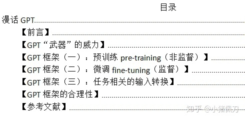

GPT是OpenAI在2018年发表的一篇论文《Improving Language Understanding by Generative Pre-Training》中提出的框架，据说在提出之后没有得到太大的关注，但是几个月后Google发布的关系密切的BERT却成为了现在NLP的通用结构。

预训练语言模型在众多语言任务上取得了突破。因此，预训练语言模型的知识将在一段时间内成为NLP工作的基础，另一方面，即使后面又出现了更厉害的思想，相信也会蕴含本次突破的基因。

这篇GPT的文章将是有关“预训练语言模型”的系列文章中的第一篇，现在，让我们开始吧。

## 【GPT“武器”的威力】

现在，我们先去了解GPT的结构，也不问其他细节，只看看GPT的威力如何，就像007选择武器之前先问下：它威力在哪？

首先，从GPT武器给出的测试报告（论文4.2节）上看：

一个威力在于“量”上的提高：在4类（natural language inference, question answering, semantic similarity, text classification）共12项测试中取得了最优效果。这说明如果你采用GPT的框架，很大概率能在语言理解的任务上取得比采用其他模型更好的效果。

另一个威力关于“质”，相比以往深度学习模型，GPT更能在少量标注训练数据的情况下表现“优秀”。这样一来，一方面说明GPT解决了以往深度学习模型的一个短板，必然有内在的理论突破；另一方面，在现实意义上，因为涉及语言理解的问题很多，现实是除非公司下血本，否则不会针对每个问题都雇专家标注大量语料（比如文言文的机器阅读理解和保险行业的机器阅读理解就需要不同的标注语料），但现在，如果GPT可以在少量语料下解决问题，就代表公司可以请专家做少量标注语料的工作就能达到需求。

上述“量”的提高，应该可以确证。但是，上述GPT关于“质”的提高，不能很确定。因为小训练数据的STS-B测试使用ECNU方案也取得了81.0的pc指标，与GPT取得的82.0的pc值差得并不多。

总的来说，我这样理解GPT：在多项任务上有普遍提高（有的幅度甚至不小，能达到7~8%），但有没有在人工标注的训练数据依赖上产生突破，不能确定。

## 【环节一：预训练pre-training（非监督）】

第一个问题，这个环节的功能是什么？

答：初始化一个神经网络。

第二个问题，这个神经网络的作用是什么？

答：完成语言模型的功能。具体来说：

根据用户之前的输入预测下一个符号的概率分布，例如：

中文简体常用汉字7000左右，在向GPT的神经网络输入“我想看陈赫演的爱”时，它会输入一个7000符号的概率分布，其中，大部分符号的概率极低，但“情”字的概率可能较高（爱情公寓），“乐”的概率可能略低于情（爱乐之城），“莲”的概率也较低（爱莲说）；但当输入是“我想看周敦颐的爱”时，“莲”的概率可能会变得较高。

第三个问题，GPT如何初始化这个神经网络，才实现了语言模型？

1. GPT先设计好网络结构：多层transformer decoder，这时里面的参数可能是随机的；

2. GPT输入未标注的语料，进行非监督学习，不断通过SGD策略调整神经网络的参数，使得神经网络在给定上文的情况下对于下一个字预测的准确率越来越高。

更细节的问题：

GPT的网络结构图如何？多少层？每层结构如何？

请看本文参考文献《Improving Language Understanding by Generative Pre-Training》的3.1节，“multi-layer Transformer decoder”的参考文献

这个神经网络是如何进行非监督学习的？

先举例说明：

我们以一篇新闻为输入：

对于第二行第十四个字，神经网络根据前文计算出这个字为“删”的条件概率，依次从语料的第一个字到最后一个字，当前的神经网络对每个字计算出对应条件概率，这样得到整段语料的成立概率。

不同的网络参数，导致神经网络计算出的语料概率也有高有低，通过反复调整网络参数，找到一组网络参数，使得语料概率最高，如果不考虑泛化性等其他因素，这时神经网络就训练好了，成为了语言模型。

再公式说明：

一个用户输入的形式为：

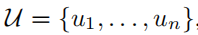

对于用户输入中的每个符号u0，神经网络根据其上文计算其概率分布：

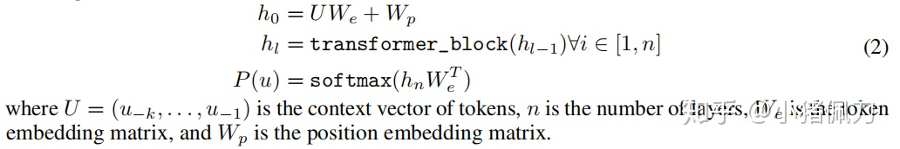

整段用户输入作为一条训练数据，计算一个目标函数，形式为标准语言模型的目标函数：

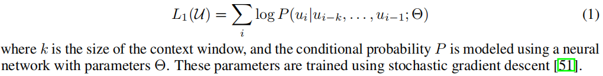

然后通过stochastic gradient descent的方式调整网络参数，以最大化目标函数。

## 【环节二：微调fine-tuning（监督）】

GPT的fine-tune有以下几个特点：

一是参与fine-tune的模型既包括第一环节的预训练模型，也包括接在预训练模型之后的线性模型；

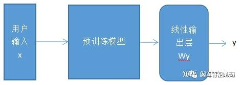

其中，线性输出层为：

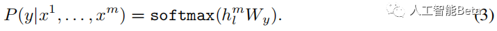

二是fine-tune也和其他训练过程一样，根据训练数据将某个根据网络参数计算出的一个目标函数，将其最大化的过程中通过反向传播的方式不断调整网络参数，达到学习的过程。GPT在fine-tune时的目标函数是2部分的叠加，一部分是根据训练数据（feature+label）计算出的L2（见下式4），一部分是根据训练数据（仅feature）计算出的L1（见上式1）

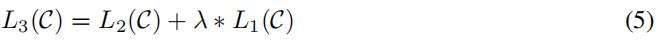

其中，

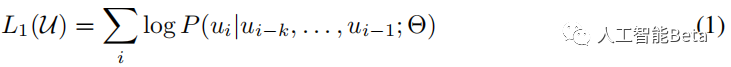

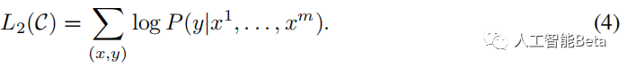

三是GPT框架可以适用于多类任务的fine-tune，需要对输入做一些变换（input transformation），在下一节介绍。

## 【环节三：任务相关的输入转换】

以前处理不同任务，会根据任务设计特定的模型结构，模型的输入格式也不相同。例如句子情感分类就是一个多分类的网络，输入是一个句子和对应的情感多分类label；句子相似性判断是一个孪生网络，输入是2个句子和二分类的label。

GPT建议将不同格式的输入都转化为一个或多个序列，保持预训练语言模型的输入形式不变。如果是多个序列，则分别由预训练模型训练，再根据任务将输出做不同的简单处理拼接。

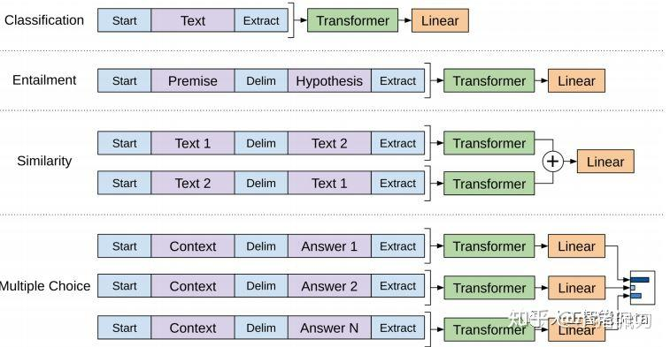

举例来说：

句子分类任务（上图第一行），直接在句子首尾加上 &lt;s&gt; 和 &lt;e&gt; 符号，形成一个序列，输入fine-tune模型；而阅读理解任务（上图最后一行），则将原文+问题作为Context，再分别与N个候选答案拼接，形成N个序列，这N个序列依次输入fine-tune模型，得到N个输出，最终将N个输出进行softmax计算。

## 【GPT框架的合理性】

参考文献的第5节专门回答了以下几个问题：

预训练模型设置多少层为好？

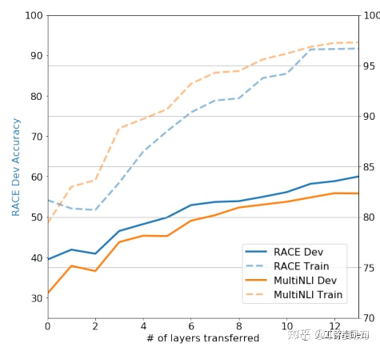

从上面看出，在1~12层范围内，层数越多，对测试的提升越多。但随着层数的增加，增益也逐渐减少，并带来更多的训练时间。

预训练模型真的能对多项任务都起到帮助吗？

本论文做的实验是不用fine-tune，直接使用预训练网络去解决多项任务。不同颜色折线代表不同任务，纵坐标为测试表现，横坐标为预训练模型训练更新次数（我理解是训练batch数）。

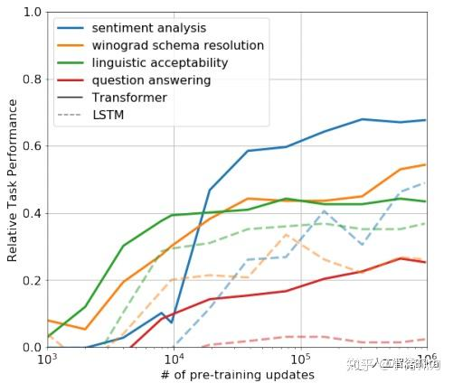

从上图可以看出，没有使用任务相关的训练语料，而是使用通用非标注语料训练出的预训练模型，在多项任务上有一些表现（虽然比不上fine-tune后的模型表现），而且训练次数越多，表现越好。

这个实验说明了3点：一是对预训练模型的训练不是无用功，因为训练次数越多，表现越好；二是预训练模型不只对一项任务，而是对多项任务都能有一定的表现，也就是学到了些普适知识；三是用于训练预训练模型的语料是和特定任务无关的，也就是zero-shot的效果是存在的。

