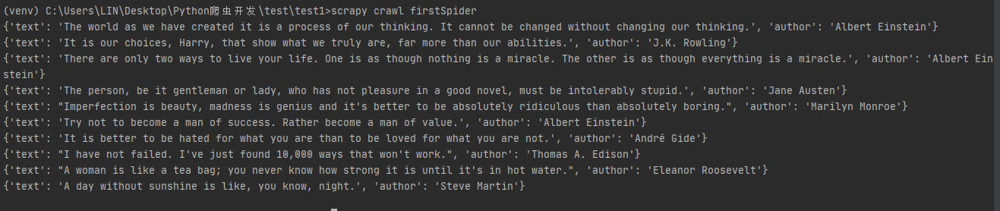

# Scrapy

在爬取之前，我们先来学习一下什么Scrapy框架。

Scrapy是一个基于Twisted的异步处理框架，是纯Python实现的爬虫框架，是提取结构性数据而编写的应用框架，其架构清晰，模块之间的耦合程度低，可扩展性极强，我们只需要少量的代码就能够快速抓取数据。

## Scrapy框架

首先我们看看经典的Scrapy框架架构图，如下图所示：


学Scrapy框架的绝大部分都看过这个图，图中分了很多部分，接下来，我们通过下面的表来简单地了解各个部分的作用。

|名称|作用|是否要手写代码|
|---|---|---|
|Engine|引擎，负责数据和信号的在不同模块间的传递。|否|
|Scheduler|调度器，存放引擎发过来的requests请求，在引擎再次请求的时候将请求提供给引擎。|否|
|Downloader|下载器，下载网页响应的内容并将内容返回给引擎。|否|
|Spiders|爬虫，处理引擎传过来的网页内容并提取数据、url，并返回给引擎。|是|
|Item Pipeline|管道，处理引擎传过来的数据，主要任务是清洗、验证和存储数据。|是|
|Downloader Middlewares|下载器中间件，位于引擎和下载器之间的桥梁框架，主要是处理引擎与下载器之间的请求及响应，可以自定义下载扩展，如设置代理。|一般不用手写|
|Spider MiddlewaresSpider|中间件，位于引擎和爬虫之间的桥梁框架，主要处理向爬虫输入的响应和输出的结果及新的请求。|一般不用手写|

在表中，我们可以发现，每部分都要经过引擎，上图中Scrapy Engine部分也是放在正中心，由此可知，Engine引擎是整个框架的核心。

注意：这些模块部分只有Spiders和Item Pipeline需要我们自己手写代码，其他的大部分都不需要。

## Scrapy项目

大致了解了Scrapy框架的各个部分后，接下来我们开始创建一个Scrapy项目，可以使用如下命令：

``` shell
scrapy startproject <Scrapy项目名>
```

创建一个scrapy项目名为test1的项目，如下图所示：


这样我们就创建好Scrapy项目了，如下图所示：


其中：

- spiders：存放spiders的文件夹；
- items.py：Items的定义，定义爬取的数据结构；
- middlewares.py：项目中间件文件，定义爬取时的中间件；
- pipelines.py：项目管道文件，定义数据管道；
- settings：项目设置文件；
- scrapy.cfg：Scrapy部署配置文件。

## Spider爬虫

创建spider爬虫

要创建Spider爬虫，首先我们要进入刚才创建的Scrapy目录中，再在命令行运行以下命令：

``` shell
scrapy genspider <爬虫名字> <允许爬取的域名>
```

以http://quotes.toscrape.com网站为例子，该网站是一个著名作家名言的网站，创建Spider爬虫如下图所示：


创建spider爬虫后，spiders文件夹中多了一个firstspider.py，这个py文件就是我们创建爬虫，文件内容如下所示：

``` python
import scrapy

class FirstspiderSpider(scrapy.Spider):
    name = 'firstSpider'
    allowed_domains = ['quotes.toscrape.com']
    start_urls = ['http://quotes.toscrape.com/']

    def parse(self, response):
        pass
```

其中：

- class FirstspiderSpider()是自定义spider类，继承自scrapy.Spider
- name是定义此爬虫名称的字符串，每个项目唯一的名字，用来区分不同的Spider，启动爬虫时使用scrapy crawl +该爬虫名字；
- allowed_domains是允许爬取的域名，防止爬虫爬到其他网站；
- start_urls是最开始爬取的url；
- parse()方法是负责解析返回响应、提取数据或进一步生成要处理的请求，注意：不能修改这个方法的名字。

parse()提取数据并启动爬虫

大致了解了firstspider.py文件内容后，我们接下来尝试在parse()方法中提取响应的数据，具体代码如下所示：

``` python
xpath_parse = response.xpath('/html/body/div[1]/div[2]/div[1]/div')
for xpath in xpath_parse:
    item = {}
    item['text'] = xpath.xpath('./span[1]/text()').extract_first().replace('“','').replace('”','')
    item['author'] = xpath.xpath('./span[2]/small/text()').extract_first()
    print(item)
```

这样我们就成功提取到引擎响应的内容数据了，接着输入以下命令来运行spider爬虫：

``` shell
scrapy crawl firstSpider
```

运行结果如下：


运行后发现我们结果里面多了很多log日志，这时可以通过在settings.py添加以下代码，就可以屏蔽这些log日志：

``` python
LOG_LEVEL = "WARNING"
```

这样就可以直接输入我们想要的内容，如下图所示：



有人可能问：那User-Agent在哪里设置？

我们可以在settings.py中设置User-Agent，代码如下所示：


items.py介绍

为了避免拼写错误或者定义字段错误，我们可以在items.py文件中定义好字段，在上面提取数据中，我们获取了text、author内容，所以我们可以在items.py定义text和author字段，具体代码如下所示：

``` python
import scrapy

class Test1Item(scrapy.Item):
    text = scrapy.Field()
    author = scrapy.Field()
```

在items.py文件中，我们只需要使用scrapy.Field()来进行定义即可，scrapy.Field()是一个字典，总的来说我们可以把该类理解为一个字典。

接着在firstspider.py文件中导入我们的items.py，以及修改item={}，如下所示：

``` python
from test1.items import Test1Item

item = Test1Item()
```

有人可能会说为什么要多此一举定义一个字典呢？

当我们在获取到数据的时候，使用不同的item来存放不同的数据，在把数据交给pipeline的时候，可以通过isinstance(item,Test1Item)来判断数据属于哪个item，进行不同的数据(item)处理。

例如我们获取到京东、淘宝、拼多多的数据时，我们可以items.py文件中定义好对应的字段，具体代码如下：

``` python
import scrapy

class jingdongItem(scrapy.Item):
    text = scrapy.Field()
    author = scrapy.Field()

class taobaoItem(scrapy.Item):
    text = scrapy.Field()
    author = scrapy.Field()

class pddItem(scrapy.Item):
    text = scrapy.Field()
    author = scrapy.Field()
```

定义好字段后，这是我们通过在 pipeline.py 文件中编写代码，对不同的 item 数据进行区分，具体代码如下：

``` python
from test1.items import jingdongItem

class Test1Pipeline:
    def process_item(self, item, spider):
        if isinstance(item,jingdongItem):
            print(item)
```

首先我们通过导入我们的 items.py，通过 isinstance() 函数来就可以成功获取到对应的 item 数据了。

pipelines.py 介绍

Item Pipeline 为项目管道，当 Item 生成后，它就会自动被送到 Item Pipeline 进行处理，我们常用 Item Pipeline 来做以下操作：

- 清理HTML数据；
- 验证爬取数据，检测爬取字段；
- 查看并丢弃重复内容；
- 将爬取结果保存到数据库。

pipelines.py 内容如下所示：

``` python
from itemadapter import ItemAdapter

class Test1Pipeline:
    def process_item(self, item, spider):
        return item
```

在 process_item() 方法中，传入了两个参数，一个参数是 item，每次 Spider 生成的 Item 都会作为参数传递过来。另一个参数是 spider，就是 Spider 的示例。

完成 pipeline 代码后，需要在 setting.py 中设置开启，开启方式很简单，只要把 setting.py 内容中的以下代码的注释取消即可：

``` python
ITEM_PIPELINES = {
    'test1.pipelines.Test1Pipeline': 300,
}
```

其中：

- test1.pipelines.Test1Pipeline是pipeline的位置；
- 300是pipeline的权重。

注意：

- pipeline的权重越小优先级越高；
- pipeline中的process_item()方法名不能修改为其他的名称；
- pipeline能够定义多个。

当我们有多个spider爬虫时，为了满足不同的spider爬虫需求，这时可以定义不同的pipeline处理不同的item内容；

当一个spider的内容可能要做不同的操作时，例如存入不同的数据库中，这时可以定义不同的pipeline处理不同的item操作。

例如当我们有多个spider爬虫时，可以通过pipeline.py编写代码定义多个pipeline，具体代码如下：

``` python
class jingdongPipeline1:
    def process_item(self, item, spider):
        if spider.name=="jingdong":
            print(item)
        return item

class taobaoPipeline:
    def process_item(self, item, spider):
        if spider.name=="taobao":
            print(item)
        return item
```

这样我们就可以处理到对应的spider爬虫传递过来的数据了。

定义好pipeline后，我们要在settings.py中设置pipeline权重，也就是那个pipeline先运行，具体代码如下：

``` python
ITEM_PIPELINES = {
   'test1.pipelines.jingdongPipeline': 300,
   'test1.pipelines.taobaoPipeline': 301,
}
```

数据传输到pipeline中

在上面我们已经提取到想要的数据，接下来将数据传到pipeline中，传输很简单，我们只需要使用yield，代码如下：

``` python
yield item
```

没错，只要在spider爬虫中写入这一行代码即可，那么为什么要使用yield呢？，我用return不能行吗？

行，但yield是让整个函数变成一个生成器，每次遍历的时候挨个读到内存中，这样不会导致内存的占用量瞬间变高。

实现翻页

我们成功获取到了一页数据了，那么问题来了，如何实现翻页呢，方法有很多种，我们主要介绍两种。

第一种：使用start_requests()方法
我们通过在spider爬虫中，也就是我们创建的firstspider.py中添加以下代码，具体代码如下：

``` python
def start_requests(self):
    for i in range(1,3):
        url = f'https://quotes.toscrape.com/page/{i}/'
        yield scrapy.Request(url = url, callback = self.parse)
```

第二种：在parse()方法中实现翻页

我们可以通过parse()方法中实现翻页，具体代码如下：

``` python
for i in range(2,3):
    url = f'https://quotes.toscrape.com/page/{i}/'
    yield scrapy.Request(url = url, callback = self.parse)
```

大家可以发现，上面两种翻页方式都差不多，只是一个在start_requests()方法实现，一个在parse()方法实现。

但都要使用scrapy.Request()方法，该方法能构建一个requests，同时指定提取数据的callback函数

``` python
scrapy.Requeset(url, callback, method = 'GET', headers, cookies, meta, dont_filter = False)
```

其中：

- url：表示爬取的url链接；
- callback：指定传入的url交给哪个解析函数去处理；
- headers：请求头；
- cookies：用于识别用户身份、进行回话跟踪而存储在用户本地终端上的数据；
- meta：实现在不同的解析函数中传递数据；
- dont_filter：让scrapy的去重不会过滤当前url，scrapy默认有url去重的功能。

保存数据

我们已经获取到数据而且实现了翻页，接下来是保存数据。

保存在文件中

当我们要把数据保存成文件的时候，不需要任何额外的代码，只要执行如下代码即可：

``` shell
scrapy crawl spider爬虫名 -o xxx.json #保存为JSON文件
scrapy crawl spider爬虫名 -o xxx.jl或jsonlines #每个Item输出一行json
scrapy crawl spider爬虫名 -o xxx.csv #保存为csv文件
scrapy crawl spider爬虫名 -o xxx.xml #保存为xml文件
```

想要保存为什么格式的文件，只要修改后缀就可以了，在这里我就不一一例举了。

保存MongoDB中

当我们要把数据保存在MongoDB数据库的时候，就要使用Item Pipeline模块了，也就是说要在pipeline.py中编写代码，具体代码如下所示：

``` python
from pymongo import  MongoClient
client=MongoClient()
collection=client["test1"]["firstspider"]

class Test1Pipeline:
    def process_item(self, item, spider):
        collection.insert(item)
        return item
```

首先我们导入MongoClient模块并实例化MongoClient，创建一个集合，然后在process_item()方法中使用insert()方法把数据插入MongoDB数据库中。

好了，Scrapy知识就讲到这里，接下来爬取北京新发地价格行情，顺便巩固我们今天学的知识。

实战演练

爬取分析

首先我们进入北京新发地价格行情网页并打开开发者工具，如下图所示：


经过简单的查找，发现每个getPriceData.html存放着价格行情的数据，由此可得，我们可以通过getPriceData.html来进行数据的获取。

观察Headers请求，如下图所示：


发现它是POST请求，请求URL链接是http://www.xinfadi.com.cn/getPriceData.html，current是翻页的重要参数，limit是每页有多少行数据，我们可以构造消息体，代码如下所示：

``` python
data = {
    'limit': '20',
    'current': page
}
```

通过scrapy.Request()方法将消息体传入到参数里面。

或者我们可以根据测试和观察规律，自己构造URL链接，通过观察分析，请求的URL链接可以为：

``` shell
http://www.xinfadi.com.cn/getPriceData.html?limit=20&current=1
http://www.xinfadi.com.cn/getPriceData.html?limit=20&current=2
http://www.xinfadi.com.cn/getPriceData.html?limit=20&current=3
```

创建Spider爬虫

分析北京新发地价格行情后，接下来我们首先创建一个Scrapy项目，使用如下命令：

``` shell
scrapy startproject Vegetables
```

这样我们就成功创建了一个Scrapy项目，项目文件如下所示：


接下来创建spider爬虫，使用如下命令：

``` shell
scrapy genspider vegetables www.xinfadi.com.cn
```

创建后vegetables.py内容如下所示：

``` python
import scrapy

class VegetablesSpider(scrapy.Spider):
    name = 'vegetables'
    allowed_domains = ['www.xinfadi.com.cn']
    start_urls = ['https://www.xinfadi.com.cn']

    def parse(self, response):
        pass
```

提取数据

在提取数据前，我们首先把要爬取的数据字段在items.py文件中定义好，代码如下所示：

``` python
import scrapy

class VegetablesItem(scrapy.Item):
    # define the fields for your item here like:
    productName = scrapy.Field()
    lowPrice=scrapy.Field()
    highPrice=scrapy.Field()
```

这里我们定义了三个字段分别是productName、lowPrice、highPrice

定义好字段后，接下来将在创建的vegetables.py文件中进行数据的提取，具体代码如下：

``` python
import scrapy
from Vegetables.items import VegetablesItem

class VegetablesSpider(scrapy.Spider):
    name = 'vegetables'
    allowed_domains = ['www.xinfadi.com.cn']
    def start_requests(self):
        for i in range(1, 3):
            url = f'http://www.xinfadi.com.cn/getPriceData.html?limit=20&current={i}'
            yield scrapy.Request(url=url, callback=self.parse)

    def parse(self, response):
        html = response.json()
        fooddata = html.get('list')
        for i in fooddata:
            item=VegetablesItem()
            item['highPrice'] =i.get('highPrice'),
            item['lowPrice'] = i.get('lowPrice'),
            item['prodName'] = i.get('prodName'),
            yield item
```

首先我们导入vegetablesitem，使用start_requests函数实现翻页，大家可以使用刚才我们所讲的方法实现翻页，实现翻页后，我们通过编写parse()方法实现数据的获取，首先我们把引擎响应的数据以json()格式存放在html里面，调用get()方法来提取我们想要的数据，最后通过yield生成器返回给引擎。

最后我们在settings.py设置引擎的启动，代码如下所示：

``` python
ITEM_PIPELINES = {
   'Vegetables.pipelines.VegetablesPipeline': 300,
}
```

在这里我们就不保存数据在MongoDB数据库里面了，我们直接启动Spider爬虫并把数据以csv格式输出，使用如下命令：

``` shell
scrapy crawl vegetables -o 11.c
```

运行结果如下：


好了，Scrapy框架爬取北京新发地就讲解到这里了，感谢观看！！！
