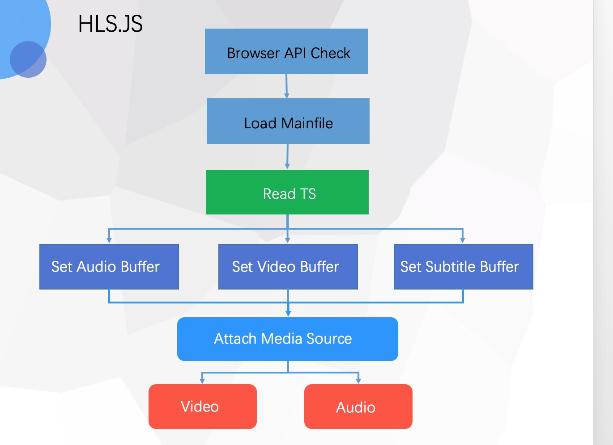

# 视频直播的方案

rtmp + m3u8 只有flash支持，video.js或者mediaelement.js，多插件方案

目前 Youtube 和 Netflix 等主流视频网站，即使 FB 的 newsfeed 里面的视频也采用了 HLS 的解决方案，大致实现流程如下：

其核心，在于对于 m3u8 的文件解析和 通过 XHR 去完成对分片内容二进制文件的获取，然后使用 MSE 的 appendBuffer 去进行 buffer 的封装，然后自己完成合流的工作。目前国内的，bilibili 最早实现了基于 MSE 解决方案的播放器，大概为什么他们必须用 MSE 而不是**优酷**和**腾讯**的多*video*方案，可能是钱少，视频转MP4需要大量服务器，当然 MSE  这是技术的趋势。前面废话太多直接上推荐吧：优先推荐 video.js 的方案，因为它支持多个播放核心，而且插件非常多，你只需要使用 videojs/videojs-contrib-hls 就可以了。再安利一个非常纯粹的方案，就是 hls.js 它需要你手进行 video 的绑定。75 Team 也开源 的一个播放器：Chimeejs/chimee

作者：蒲小花
链接：https://www.zhihu.com/question/21087379/answer/252216119
来源：知乎
著作权归作者所有。商业转载请联系作者获得授权，非商业转载请注明出处。

https://github.com/videojs/videojs-contrib-hls
https://github.com/Chimeejs/chimee
https://github.com/video-dev/hls.js

服务器的MIME-Type
配置服务器：
.M3U8   application/x-mpegURL or vnd.apple.mpegURL
.ts     video/MP2T

https://www.cnblogs.com/baiyygynui/p/6323565.html